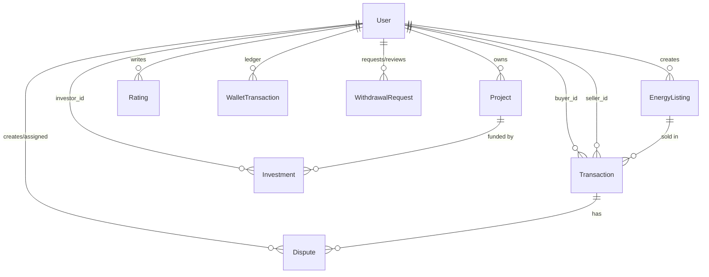

# PowerNest System Architecture

## 1) Runtime Architecture

- Frontend: Next.js 14 App Router (`frontend/`)
- Backend: Express + Prisma (`backend/`)
- Database: PostgreSQL
- Auth: JWT (`id`, `role`, `is_admin`)

## 2) Role Model

- `SELLER`: creates listings/projects, manages orders, requests withdrawals.
- `BUYER`: browses listings, purchases energy, tracks history, submits ratings/disputes.
- `INVESTOR`: funds projects, tracks portfolio, requests withdrawals.
- `ADMIN` capability: implemented via `users.is_admin = true` flag, not a separate enum role.

## 2.1) Optimized Folder Structure

```text
HacKathon/
  backend/
    config/
    controllers/
      adminController.js
      authController.js
      buyerController.js
      disputeController.js
      investorController.js
      sellerController.js
      walletController.js
    middleware/
    routes/
      admin.js
      auth.js
      buyer.js
      disputes.js
      investor.js
      listings.js
      projects.js
      seller.js
      transactions.js
      wallet.js
    services/
      walletService.js
    schema.prisma
    migrations/
  frontend/
    app/
      dashboard/
        admin/page.js
        buyer/page.js
        investor/page.js
        seller/page.js
      login/
      register/
      error.js
      not-found.js
      page.js
    components/
    context/
    services/api.js
  docs/
    API_REFERENCE.md
    ARCHITECTURE.md
    PRODUCTION_CHECKLIST.md
```

## 3) Core Domain Flows

- Energy purchase flow:
  1. Buyer purchases listing.
  2. Buyer wallet debited (energy + platform commission) into escrow hold.
  3. Seller completes/cancels order.
  4. On completion: seller credited net payout.
  5. On cancel/refund: buyer credited full held amount and listing units restored.

- Investment flow:
  1. Investor funds project.
  2. Investor wallet debited (principal + fee).
  3. Project funding increases.
  4. Seller wallet receives principal funding.
  5. Project auto-closes when fully funded.

- Withdrawal flow:
  1. Seller/Investor creates withdrawal request.
  2. Admin approves/rejects.
  3. Admin marks paid, debiting wallet and logging ledger record.

## 4) Database Schema (high-level)



## 5) Security Layers

- `helmet` headers
- strict CORS allowlist
- request rate-limiter
- Joi payload validation
- JWT auth middleware
- role guards + admin guard
- suspended-account blocking
- bcrypt password hashing

## 6) Scalability Notes

- Pagination added for heavy list endpoints.
- Wallet ledger normalized for auditability.
- Platform fee rates centralized in `platform_settings`.
- Frontend API uses request de-duplication + TTL cache for repeated dashboard reads.
